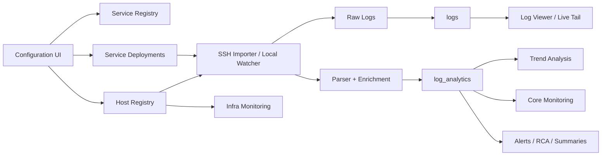

# OpsCore-Observality-Inteliigence

OpsCore is a service-level observability and operations platform for 6D Billing Ops. It combines log ingestion, analytics, infrastructure monitoring, alerting, RCA workflows, auditability, and operational configuration in one application.

This build has been moved toward a modular, service-first architecture while preserving backward compatibility with the legacy module-based application model.

## Contents

1. Overview
2. Architecture
3. Domain Model
4. Runtime Flow
5. Repository Structure
6. Configuration Model
7. Database Schema
8. API Surface
9. UI Modules
10. Performance Design
11. Scaling Strategy
12. Security and Access Control
13. Deployment and Startup
14. Migration Notes
15. Testing and Verification Guidance
16. Roadmap

## Overview

OpsCore provides:

- Service-level observability for business applications such as Billing, NGW, SAP, and DB Monitor
- Host-level infrastructure monitoring for CPU, memory, load, disk, and import health
- Trend Analysis with service, host, endpoint, URL, IP, TPS, latency, and exception views
- Core Monitoring pages for service drill-down
- Raw log ingestion from SSH and local watcher pipelines
- Alerting and RCA enrichment
- RFC, incident, team, timesheet, and managed-service operational workflows

## Architecture

The target architecture separates infrastructure concerns from service observability concerns.



### Architectural Principles

- `service` is the primary observability entity
- `host` is the infrastructure and deployment entity
- `deployment` maps service to host and log scope
- dashboards should read analytics, not raw logs
- shared-host traffic must be isolated by service scope
- scaling must remain open through narrower query boundaries and aggregate-first reads

## Domain Model

### 1. Service

Represents an application or runtime capability.

Examples:

- `billing`
- `ngw`
- `sap`
- `db_monitor`
- future custom application services

Typical fields:

- `id`
- `label`
- `kind`
- `owner_team`
- `min_role`
- `enabled`
- `description`

### 2. Host

Represents a machine, VM, node, or runtime target.

Typical fields:

- `id`
- `label`
- `hostname`
- `username`
- `auth_mode`
- `log_paths`
- `poll_interval_seconds`
- `status`
- `monitor_metrics`

### 3. Service Deployment

Represents where a service runs and which logs belong to it.

Typical fields:

- `service_id`
- `host_id`
- `log_paths`
- `log_prefix`
- `active`

### 4. Raw Log

Represents imported or tailed log lines.

Important fields:

- `service_id`
- `host_id`
- `log_path`
- `level`
- `message`
- `raw`
- `timestamp`

### 5. Analytics Event

Represents parsed business telemetry derived from logs.

Important fields:

- `service_id`
- `host_id`
- `log_path`
- `log_date`
- `log_hour`
- `request_method`
- `request_path`
- `request_url`
- `status_code`
- `response_time_ms`
- `remote_addr`
- `exception_type`
- `is_error`
- `is_timeout`
- `is_exception`

## Runtime Flow

### Service Observability Flow

1. A host is configured
2. A service is configured
3. A deployment binds the service to host and log scope
4. The importer or local watcher reads scoped logs
5. Raw log lines are stored in `logs`
6. Parsers derive request/response telemetry
7. Parsed rows are stored in `log_analytics`
8. Trend Analysis and Core Monitoring query service/host/path scoped analytics

### Infrastructure Flow

1. Host is configured with monitor metrics
2. Infra metrics are collected and stored
3. Infra pages query host-centric metrics
4. Infra remains separate from service-level business observability

## Repository Structure

Current repository layout:

```text
api/
architecture/
configs/
core/
deploy/
docs/
logs/
offline_pkgs/
static/
templates/
tests/
tools/
app.py
config.json
docker-compose.yml
Dockerfile
requirements.txt
```

### Key Application Files

- [D:\M Y - R E P O S I T O R Y\P P D 1.0.5\app.py](D:\M Y - R E P O S I T O R Y\P P D 1.0.5\app.py)
  - main Flask application
  - routes
  - config normalization
  - compatibility bridge between legacy modules and new services

- [D:\M Y - R E P O S I T O R Y\P P D 1.0.5\core\db.py](D:\M Y - R E P O S I T O R Y\P P D 1.0.5\core\db.py)
  - DB schema
  - migrations
  - analytics queries
  - data access methods

- [D:\M Y - R E P O S I T O R Y\P P D 1.0.5\core\ssh_importer.py](D:\M Y - R E P O S I T O R Y\P P D 1.0.5\core\ssh_importer.py)
  - remote log collection over SSH
  - service-aware raw log and analytics insertion

- [D:\M Y - R E P O S I T O R Y\P P D 1.0.5\core\log_analytics.py](D:\M Y - R E P O S I T O R Y\P P D 1.0.5\core\log_analytics.py)
  - request/response parsing
  - analytics extraction

- [D:\M Y - R E P O S I T O R Y\P P D 1.0.5\core\log_watcher.py](D:\M Y - R E P O S I T O R Y\P P D 1.0.5\core\log_watcher.py)
  - local tailing
  - service-aware parse/store

### Key UI Templates

- [D:\M Y - R E P O S I T O R Y\P P D 1.0.5\templates\base.html](D:\M Y - R E P O S I T O R Y\P P D 1.0.5\templates\base.html)
  - shell
  - sidebar
  - topbar
  - global search
  - chart defaults

- [D:\M Y - R E P O S I T O R Y\P P D 1.0.5\templates\analytics.html](D:\M Y - R E P O S I T O R Y\P P D 1.0.5\templates\analytics.html)
  - Trend Analysis page

- [D:\M Y - R E P O S I T O R Y\P P D 1.0.5\templates\config.html](D:\M Y - R E P O S I T O R Y\P P D 1.0.5\templates\config.html)
  - Configuration UI
  - service-first operator forms

- [D:\M Y - R E P O S I T O R Y\P P D 1.0.5\templates\module_dynamic.html](D:\M Y - R E P O S I T O R Y\P P D 1.0.5\templates\module_dynamic.html)
  - generic service/module monitoring page

## Configuration Model

The application currently supports both:

- legacy `modules`
- new `services`

The compatibility layer keeps both synchronized.

### Current Logical Model

```json
{
  "services": {
    "billing": {
      "label": "Billing App",
      "kind": "application",
      "min_role": "user",
      "enabled": true,
      "description": "Billing observability service"
    }
  },
  "hosts": [
    {
      "id": "billing-01",
      "label": "Billing Host",
      "hostname": "10.0.0.10",
      "username": "opsuser",
      "module": "billing",
      "log_paths": ["/var/log/billing/app.log"]
    }
  ],
  "service_deployments": [
    {
      "service_id": "billing",
      "host_id": "billing-01",
      "log_paths": ["/var/log/billing/app.log"],
      "log_prefix": "/var/log/billing",
      "active": true
    }
  ],
  "modules": {
    "billing": {
      "label": "Billing App",
      "host_id": "billing-01",
      "enabled": true
    }
  }
}
```

### Compatibility Notes

- `services` is the new observability source of truth
- `modules` remains for legacy routes and page compatibility
- host forms still carry `module` because that field is used as a service binding bridge
- config load normalizes both directions automatically

## Database Schema

OpsCore supports:

- SQLite fallback / local mode
- MySQL primary / scalable mode

### Core Tables

#### `hosts`

Stores configured runtime targets.

Columns include:

- `id`
- `label`
- `hostname`
- `username`
- `password`
- `auth_mode`
- `key_path`
- `log_paths`
- `poll_interval`
- `status`
- `last_seen`
- `last_import`
- `import_count`

#### `services`

Stores service registry entries.

Columns include:

- `id`
- `label`
- `kind`
- `owner_team`
- `min_role`
- `enabled`
- `description`
- `metadata`
- `created_at`
- `updated_at`

#### `service_deployments`

Stores service-to-host mapping.

Columns include:

- `id`
- `service_id`
- `host_id`
- `log_paths`
- `log_prefix`
- `active`
- `metadata`
- `created_at`
- `updated_at`

#### `logs`

Stores raw logs.

Columns include:

- `id`
- `service_id`
- `host_id`
- `log_path`
- `level`
- `message`
- `raw`
- `timestamp`
- `created_at`

#### `log_analytics`

Stores parsed analytics facts.

Columns include:

- `id`
- `service_id`
- `host_id`
- `log_path`
- `log_date`
- `log_hour`
- `request_method`
- `request_path`
- `request_url`
- `status_code`
- `response_time_ms`
- `bytes_sent`
- `remote_addr`
- `level`
- `exception_type`
- `exception_msg`
- `is_error`
- `is_timeout`
- `is_exception`
- `raw_line`
- `created_at`

#### `analytics_summary`

Stores summarized analytics rows.

Columns include:

- `id`
- `service_id`
- `host_id`
- `log_path`
- `summary_date`
- `summary_hour`
- `total_requests`
- `success_count`
- `error_count`
- `timeout_count`
- `exception_count`
- `avg_response_ms`
- `max_response_ms`
- `p95_response_ms`
- `total_bytes`
- `unique_ips`
- `updated_at`

#### Other Operational Tables

- `alerts`
- `errors`
- `alert_rules`
- `projects`
- `timesheet_entries`
- `team_members`
- `managed_service_tickets`
- `rfc_entries`
- `incident_entries`
- `mysql_monitor_results`
- `mysql_monitor_latest`
- `mysql_monitor_history`
- `infra_metrics_latest`
- `server_inventory`
- `audit_log`

### Indexing Strategy

Key indexes are present for:

- `log_analytics(host_id, log_date, request_path)`
- `log_analytics(host_id, log_date, status_code)`
- `log_analytics(host_id, log_date, response_time_ms)`
- `log_analytics(host_id, request_path, log_date, request_url)`
- `log_analytics(host_id, log_date, remote_addr)`
- `log_analytics(service_id, log_date)`
- `logs(host_id, created_at)`
- `logs(service_id, created_at)`
- `analytics_summary(service_id, summary_date)`
- `service_deployments(service_id, active)`
- `service_deployments(host_id, active)`

### Migration Behavior

On startup, DB initialization:

- creates missing tables
- adds missing columns such as `service_id`
- ensures important indexes
- preserves existing data

## API Surface

### Service and Config APIs

- `GET /api/config/modules`
- `GET /api/config/services`
- `GET /api/services`
- `POST /api/config/service`
- `DELETE /api/config/service/<service_id>`
- `POST /api/config/module`
- `DELETE /api/config/module/<module_id>`
- `POST /api/config/host`
- `DELETE /api/config/host/<host_id>`
- `GET /api/hosts`

### Analytics APIs

- `GET /api/analytics/overview`
- `GET /api/analytics/paths`
- `GET /api/analytics/status`
- `GET /api/analytics/response-times`
- `GET /api/analytics/tps-summary`
- `GET /api/analytics/endpoint-tps`
- `GET /api/analytics/service-groups`
- `GET /api/analytics/ips`
- `GET /api/analytics/methods`
- `GET /api/analytics/exceptions`
- `GET /api/analytics/probes-summary`
- `GET /api/analytics/executive`
- `GET /api/analytics/heatmap`
- `GET /api/analytics/summary`
- `POST /api/analytics/backfill`

Analytics scope currently resolves by:

- `service`
- `module`
- `host`
- `path`
- `path_prefix`
- `request_path`
- `days`

### Log APIs

- `GET /api/logs`
- `GET /api/logs/export`
- `GET /api/logs/stream`
- `GET /api/logs/module/<module_id>`
- `POST /api/import`
- `POST /api/import/all`
- `GET /api/import/status/<job_id>`

### Infra APIs

- `POST /api/infra/metrics/<host_id>/run`
- `GET /api/master/snapshot`
- additional host and metrics APIs within app routes

## UI Modules

### 1. Trend Analysis

Purpose:

- service-level observability workspace
- TPS, endpoint, latency, status, exception, consumer, and IP analysis

Key characteristics:

- observability-style visual shell
- service filter
- host filter
- lazy tab rendering behavior in client code
- business-traffic-first, not raw-log-first

### 2. Core Monitoring

Purpose:

- operator-facing service monitoring pages

Current behavior:

- legacy specialized pages still exist for Billing, NGW, SAP, DB Monitor
- generic dynamic page supports service/module style rendering
- service route alias now exists via `/service/<service_id>`

### 3. Infrastructure

Purpose:

- host-level metrics and infrastructure diagnostics

Must remain separate from application observability.

### 4. Configuration

Purpose:

- manage services
- manage hosts
- manage service-to-host bindings
- manage MySQL monitors

## Performance Design

The modular service-level model improves performance only when query scope and rendering are also constrained.

### Current Performance Practices

- service-aware scope resolution
- host and path prefix scoping for analytics
- chart defaults tuned for dashboard rendering
- reduced over-fetching on Trend Analysis
- lazy or deferred detail loading in analytics UI
- stronger separation between raw logs and analytics surfaces

### Performance Rules

- dashboards must query analytics, not raw logs
- service pages should not scan unrelated shared-host traffic
- deep tabs should lazy-load
- large tables should be paginated or narrowed by search/filter
- chart series count should be capped by default

## Scaling Strategy

Scaling must remain open in these dimensions:

- more services
- more hosts
- more deployments per service
- more endpoints
- more analytics volume
- longer retention windows

### Recommended Scaling Layers

1. raw logs
2. parsed analytics facts
3. hourly service aggregates
4. daily service aggregates
5. cached API responses

### Recommended Next-Step Enhancements

- add explicit aggregate builders for `service_id`
- add service-level cache keys
- add pagination for larger operator tables
- move expensive analytics to pre-aggregated hourly summaries
- extend query layer to filter by `service_id` directly in analytics SQL paths where appropriate

## Security and Access Control

RBAC model includes:

- `user`
- `manager`
- `admin`
- `super_administrator`

Access control is applied through:

- route decorators
- config-based permission overrides
- per-service `min_role`

Sensitive areas:

- config changes
- DB operations
- audit
- host credentials
- monitor credentials

## Deployment and Startup

### Local / SQLite-style Startup

Typical flow:

```bash
python -m venv venv
venv\Scripts\activate
pip install -r requirements.txt
python app.py
```

### MySQL-backed Startup

The application supports MySQL bootstrap on startup through `core.db.init_db()` and `core.db_bootstrap`.

### Important Startup Behavior

On startup, the app:

- initializes DB schema
- applies compatibility migrations
- syncs config hosts to DB
- may backfill analytics HTTP fields
- may start scheduler
- may start local log watcher

## Migration Notes

### Legacy to Service-First Transition

The codebase is currently in a compatibility phase:

- `services` are the new logical observability entity
- `modules` still exist for route/page compatibility
- host binding still uses `module` in some legacy forms
- service deployments now represent the correct architecture layer

### Current Compatibility Guarantees

- existing Billing/NGW/SAP pages continue to work
- existing module APIs still exist
- current UI flows are preserved as much as possible
- new service APIs and service routes are added alongside legacy module flows

## Testing and Verification Guidance

Recommended verification order:

1. Add a service in Configuration
2. Bind it to a host and log path
3. Reload and confirm binding persists
4. Open Core Monitoring page for that service
5. Import logs for the mapped host
6. Confirm Trend Analysis service filter scopes correctly
7. Confirm recent logs and analytics reflect the correct service
8. Test a shared-host case with two services and different log paths

### High-Risk Areas to Recheck After Changes

- service-to-host binding persistence
- shared-host scoping
- Trend Analysis dropdown/service prefill
- legacy specialized pages
- MySQL monitor assignment per service

## Roadmap

Recommended next phases:

1. move remaining analytics SQL to explicit `service_id` filters where applicable
2. build service aggregate tables for hourly and daily summaries
3. complete Core Monitoring service-first cards/routes end to end
4. split large backend concerns into package modules instead of the single-file `app.py`
5. add live smoke tests for config, import, analytics, and service routing

## Summary

OpsCore is evolving from a monolithic host/module-oriented operations tool into a modular, service-level observability platform.

The current codebase now includes:

- service registry
- service deployment mapping
- service-aware ingestion
- service-aware Trend Analysis scoping
- service-aware navigation and configuration paths
- backward compatibility with existing module-oriented flows

This is the correct foundation for cleaner monitoring, safer shared-host observability, and long-term scaling.
