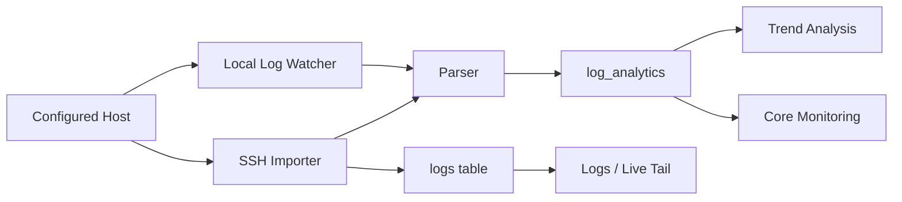
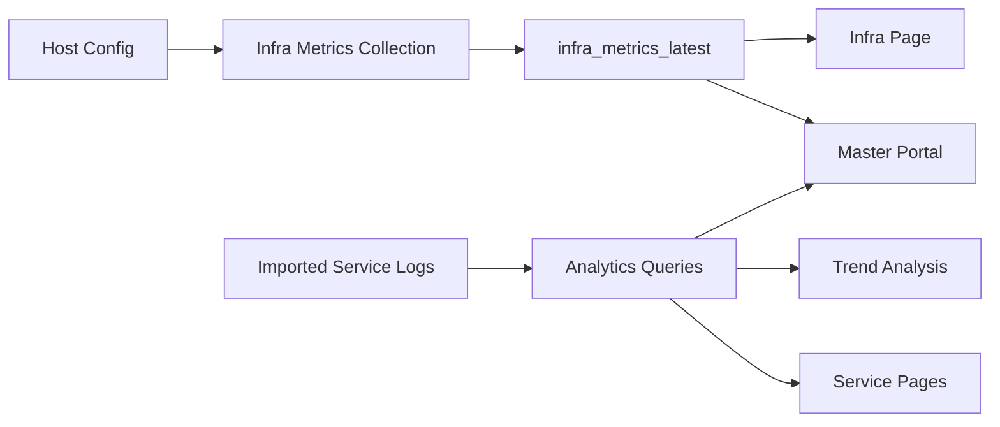
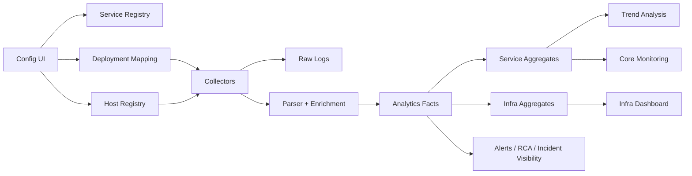

# OpsCore-Observality-Inteliigence
# HA Observability Platform Review

This document reviews the current OpsCore codebase and maps it to the target direction: a production-grade HA observability platform for microservices with a Dynatrace-style operational experience, Grafana-style dashboarding, and New Relic-style observability presentation where appropriate.

## 1. Executive Summary

The current codebase already contains a substantial observability foundation:

- multi-page operations portal
- log ingestion over SSH
- local log watcher
- parsed request/response analytics
- host monitoring
- alerting
- RCA analysis
- audit trail
- Trend Analysis dashboards
- master portal aggregation
- role-based access control
- DB bootstrap and migration support

The platform is not starting from zero. The fastest and safest path is to continue evolving the existing product rather than replacing it wholesale.

### Current maturity

- `Strong`: log ingestion, analytics extraction, operational dashboards, RBAC, configuration, DB portability
- `Partial`: service-first modeling, microservice deployment mapping, HA platform semantics, advanced metrics aggregation, modular backend structure
- `Missing or incomplete`: distributed tracing model, long-term high-volume scale optimization, topology/SLO/HA visualization modules, remaining non-observability modularization of `app.py`, live runtime/browser validation

## 2. Existing Codebase Review Summary

### Main application shell

- `app.py`
  - primary Flask app
  - route registry
  - config normalization
  - auth/session lifecycle
  - compatibility bridge between legacy modules and new services

### Core backend modules

- `core/db.py`
  - schema, migrations, CRUD, analytics queries, audit, timesheet, team, tickets, incidents, RFC, alerts, MySQL monitors, infra metrics
- `core/db_backend.py`
  - MySQL/SQLite abstraction
- `core/db_bootstrap.py`
  - MySQL bootstrap
- `core/log_analytics.py`
  - log-to-analytics parser
- `core/log_parser.py`
  - generic log parsing utilities
- `core/log_watcher.py`
  - local log tailer and analytics ingestion
- `core/ssh_importer.py`
  - remote log ingestion over SSH
- `core/infra_metrics.py`
  - host metrics collection
- `core/master_portal.py`
  - top-level NOC aggregation snapshot
- `core/mysql_monitor.py`
  - query-based DB monitor
- `core/notifications.py`
  - email/webhook notifications
- `core/smtp_mailer.py`
  - SMTP delivery and keyword-trigger support
- `core/rca_engine.py`
  - rule-based RCA hints
- `core/resilience.py`
  - circuit breakers, retries, queue, rate limiting, system health
- `core/scheduler.py`
  - background scheduling
- `core/rbac.py`
  - role and permission model
- `core/service_registry.py`
  - new service-first registry and deployment mapping helpers

### Existing frontend templates

Operational pages already exist for:

- Master Portal
- Trend Analysis
- Logs
- Live Logs
- Infra
- Alerts
- RCA
- Config
- Admin
- Audit
- Billing
- NGW
- SAP
- DB Monitor
- Automation
- Team
- Timesheet
- Managed Service
- RFC
- Incident Management
- Server Inventory

## 3. Existing Features Identified

### 3.1 Authentication, Authorization, Admin

Available:

- login/logout
- project-aware config loading
- user role model
- permission management
- admin center
- project management
- audit trail

Relevant code:

- `app.py`
- `core/rbac.py`
- `core/db.py`
- `templates/admin.html`
- `templates/audit.html`
- `templates/permissions.html`

### 3.2 Logs and Ingestion

Available:

- remote SSH log import
- async import queue
- local file watcher
- raw logs storage
- log export
- log stream endpoint
- recent logs by service/module

Relevant code:

- `core/ssh_importer.py`
- `core/log_watcher.py`
- `core/db.py`
- `templates/logs.html`
- `templates/live_logs.html`

### 3.3 Analytics and Trend Analysis

Available:

- request volume
- endpoint breakdown
- hourly traffic
- status distribution
- exception trend
- response time percentiles
- endpoint TPS trend
- top failing endpoints
- top latency endpoints
- top consumers
- service-group breakdown
- IP analysis
- method distribution
- business vs probe separation
- backfill and debug tools

Relevant code:

- `core/log_analytics.py`
- `core/db.py`
- `core/tps_engine.py`
- `templates/analytics.html`

### 3.4 Host and Infrastructure Monitoring

Available:

- infra metrics collection over SSH
- latest host metrics storage
- infra page
- host summaries in master portal

Relevant code:

- `core/infra_metrics.py`
- `core/db.py`
- `templates/infra.html`

### 3.5 Alerts and RCA

Available:

- alert rules
- alert acknowledgment
- notification support
- RCA rule engine
- RCA analysis endpoint

Relevant code:

- `core/notifications.py`
- `core/smtp_mailer.py`
- `core/rca_engine.py`
- `core/db.py`
- `templates/alerts.html`
- `templates/rca.html`

### 3.6 Operational Workflows

Available:

- incidents
- RFC
- managed service tickets
- team directory
- timesheet
- inventory
- automation page
- DB operations page

These are useful supporting operations modules and should remain intact.

## 4. Existing Routes and APIs

### Main page routes

Current pages include:

- `/master`
- `/analytics`
- `/logs`
- `/live-logs`
- `/infra`
- `/config`
- `/alerts`
- `/rca`
- `/automation`
- `/billing`
- `/ngw`
- `/sap`
- `/db-monitor`
- `/module/<module_id>`
- `/service/<service_id>`

### Key API groups

- config and registry
  - `/api/config/modules`
  - `/api/config/services`
  - `/api/services`
  - `/api/config/service`
  - `/api/config/host`
  - `/api/hosts`

- logs and ingestion
  - `/api/logs`
  - `/api/logs/export`
  - `/api/logs/stream`
  - `/api/import`
  - `/api/import/all`
  - `/api/import/status/<job_id>`

- analytics
  - `/api/analytics/overview`
  - `/api/analytics/paths`
  - `/api/analytics/hourly`
  - `/api/analytics/status`
  - `/api/analytics/exceptions`
  - `/api/analytics/response-times`
  - `/api/analytics/endpoint-tps`
  - `/api/analytics/summary`
  - `/api/analytics/executive`
  - `/api/analytics/service-groups`
  - `/api/analytics/ips`
  - `/api/analytics/methods`
  - `/api/analytics/probes-summary`
  - `/api/analytics/tps-summary`
  - `/api/analytics/backfill`

- infra
  - `/api/infra/metrics/<host_id>/run`
  - `/api/infra/metrics/latest`

- alerts and RCA
  - `/api/alerts`
  - `/api/alerts/<id>/ack`
  - `/api/alerts/rules`
  - `/api/rca/analyze`

## 5. Database Models and Storage

The current schema already supports much of the target platform.

### Existing important tables

- `hosts`
- `services`
- `service_deployments`
- `logs`
- `log_analytics`
- `analytics_summary`
- `alerts`
- `errors`
- `alert_rules`
- `infra_metrics_latest`
- `mysql_monitor_latest`
- `mysql_monitor_history`
- `audit_log`
- `team_members`
- `timesheet_entries`
- `rfc_entries`
- `incident_entries`
- `managed_service_tickets`
- `server_inventory`

### Important note

`service_id` support has already been introduced into:

- `logs`
- `log_analytics`
- `analytics_summary`

This is a critical enabler for proper microservice observability.

## 6. Monitoring and Log Flow Review

### Current log flow

### Current monitoring flow

## 7. Gap Analysis Against Dynatrace/Grafana/New Relic-style Target

### Already aligned

- dark telemetry-style UI direction
- card-driven operational dashboards
- rich analytics routes
- real operational data instead of static demo data
- host + application + alert + RCA + trend features
- filter-driven observability screens

### Partially aligned

- service-first architecture
- microservice deployment mapping
- HA semantics in UI and model
- near-real-time experience
- page-level performance tuning
- modular backend structure

### Missing or weak areas

- full package-based modular backend
- explicit service-level aggregate tables
- end-to-end `service_id` filtering in every analytics SQL path
- high-volume pagination and data-window strategies across all pages
- service topology/dependency view
- SLO/SLA modeling per service
- anomaly detection
- alert correlation
- long-term retention strategy
- cluster/replica health modeling for HA services
- trace/span model

## 8. Proposed Production Architecture

### Target architecture

### Domain split

- `Service`
  - microservice, business application, component
- `Host`
  - machine, VM, pod, node
- `Deployment`
  - mapping of service to host and log scope
- `Logs`
  - raw evidence
- `Analytics`
  - parsed telemetry for observability
- `Infra Metrics`
  - host health only

## 9. Module-wise Implementation Plan

### Module 1. Service Registry

Reuse:

- `core/service_registry.py`
- config normalization in `app.py`
- service config APIs

Extend:

- UI for multiple deployments per service
- owner/team/SLA metadata
- deployment status model

### Module 2. Host Registry and Infra Monitoring

Reuse:

- `hosts`
- `infra_metrics_latest`
- `core/infra_metrics.py`
- infra routes and pages

Extend:

- collector health
- node grouping
- cluster/replica visibility

### Module 3. Logs Platform

Reuse:

- SSH importer
- local watcher
- raw logs storage
- log viewer
- live stream

Extend:

- pagination
- service-aware query shortcuts
- large-window export safeguards

### Module 4. Analytics Engine

Reuse:

- `log_analytics`
- endpoint, TPS, latency, exception, status, IP, method queries

Extend:

- service-aware SQL filtering
- aggregate tables
- per-service summary jobs
- longer retention optimization

### Module 5. Dashboards and Trend Analysis

Reuse:

- current Trend Analysis page
- master portal snapshot
- current chart set and KPI logic

Extend:

- service-first defaults everywhere
- topology and SLO cards
- HA health panels
- lazy tab loading across all heavy views

### Module 6. Alerts and RCA

Reuse:

- alert rules
- notifications
- RCA engine

Extend:

- service-level alert routing
- alert grouping/correlation
- RCA scorecards

### Module 7. Security and Audit

Reuse:

- RBAC
- permission matrix
- audit log

Extend:

- service-scoped access if needed
- secret handling review
- API throttling by endpoint class

## 10. Database Changes Required

### Already done

- `service_id` added to `logs`
- `service_id` added to `log_analytics`
- `service_id` added to `analytics_summary`
- `services` table added
- `service_deployments` table added

### Still recommended

- dedicated service aggregate tables
  - `service_hourly_summary`
  - `service_endpoint_hourly_summary`
- service/host health summary table
- optional anomaly/event table

## 11. API Changes Required

### Already added

- service registry APIs
- service route alias
- service-aware analytics parameter resolution

### Still recommended

- explicit service-centric analytics endpoints
  - `/api/analytics/service/<service_id>/overview`
  - `/api/analytics/service/<service_id>/endpoints`
  - `/api/analytics/service/<service_id>/latency`
  - `/api/analytics/service/<service_id>/ips`
  - `/api/analytics/service/<service_id>/exceptions`

- deployment APIs
  - `/api/deployments`
  - `/api/deployments/<id>`

## 12. Frontend Pages and Components to Create or Update

### Update

- `templates/analytics.html`
  - complete service-first experience
  - HA health widgets
  - service dependency view

- `templates/config.html`
  - deployment management UI
  - service metadata editor

- `templates/module_dynamic.html`
  - rename/position as service page

- `templates/base.html`
  - service-first navigation and search grouping

### Create or split later

- `templates/service_topology.html`
- `templates/service_slo.html`
- `templates/service_cluster_health.html`
- reusable partials for:
  - KPI strip
  - health banner
  - latency charts
  - endpoint grids
  - alert summary

## 13. Performance Optimization Plan

### Backend

- use `service_id` in analytics filters where possible
- add aggregate tables for hourly summaries
- cap expensive lists and load more on demand
- avoid broad host scans for service pages
- keep imports async through queue and scheduler

### Database

- continue index coverage on host/date/path/status/latency/ip
- add service-specific aggregate indexes as new tables appear
- use retention-aware purging

### Frontend

- lazy-load deep tabs
- avoid rerendering all charts on small filter changes
- paginate heavy tables
- throttle typeahead/search
- only load visible mini-charts

### Background jobs

- separate ingestion from aggregate rebuilds
- build hourly service summaries incrementally
- schedule heavy maintenance off the critical UI path

## 14. Security and Access-Control Checks

Current strengths:

- route decorators
- permission matrix
- audit trail
- rate limiting
- resilience controls

Checks still recommended:

- review secret storage for host and DB credentials
- mask and rotate monitor credentials
- enforce stricter role checks on new service/deployment APIs
- consider environment-specific admin policies

## 15. Final Implementation Status

### Already implemented in this codebase

- service-first registry and deployment model
- `service_id` storage in logs and analytics tables
- service-aware SSH importer
- service-aware local watcher analytics ingestion
- service-aware Trend Analysis parameter resolution
- service-aware config APIs
- extracted service/config/analytics route blueprints
- end-to-end `service_id` filtering across the primary analytics SQL readers
- service aggregate table schema foundation
- service aggregate rebuild function and scheduler refresh job
- aggregate status and manual refresh APIs
- aggregate-backed TPS and hourly service traffic reads for safe service-scoped pages
- aggregate-backed endpoint TPS drill-down reads for safe service-scoped pages
- service-first Master Portal service cards
- service-scoped DB Monitor snapshot and detailed observability layout
- extracted portal/runtime route modules with preserved endpoint names
- short-TTL API caching for hot portal and analytics read endpoints
- chunked/lazy Master Portal rendering and debounced observability search flows
- reduced snapshot payload by removing unused expensive sections
- service route alias
- service-aware navigation and config page direction
- shared service registry core module extraction

### Files changed in the current implementation work

- `app.py`
- `routes/portal_routes.py`
- `routes/runtime_routes.py`
- `core/db.py`
- `core/log_analytics.py`
- `core/ssh_importer.py`
- `core/log_watcher.py`
- `core/service_registry.py`
- `templates/base.html`
- `templates/config.html`
- `templates/analytics.html`
- `README.md`

### Remaining implementation phases

1. add explicit service-scoped analytics endpoints on top of the compatibility aliases
2. extract remaining non-observability administrative/ops route groups from `app.py`
3. add topology/SLO/HA cluster visualization
4. run live runtime and browser verification with seeded or real service data

## 16. Testing Summary

### Performed

- code-path review of routes, templates, DB, ingestion, analytics, and RBAC
- integration-level inspection of service registry wiring and compatibility bridges
- Python syntax compile check for `app.py`, `core/db.py`, `core/tps_engine.py`, and new route modules
- compile verification for the new cache layer and portal/runtime route modules

### Not completed in this session

- live browser smoke test
- runtime load test
- end-to-end import test with real host data
- compile/test automation pass

### Recommended validation sequence

1. create a service and deployment
2. bind it to a host and log path
3. import logs via SSH
4. verify raw logs contain `service_id`
5. verify Trend Analysis service scoping
6. verify Core Monitoring page for that service
7. test shared-host multi-service separation

## 17. Conclusion

The codebase already contains most of the core mechanics needed for a serious HA observability platform. The correct strategy is to continue the ongoing migration:

- preserve and reuse the current ingestion, analytics, host monitoring, alerting, and UI assets
- complete the service-first architecture
- modularize the backend out of `app.py`
- optimize aggregate paths for large-scale operation

This approach minimizes risk, preserves existing behavior, and gets the product to a true Dynatrace/Grafana-style operational platform faster than a full rewrite.
